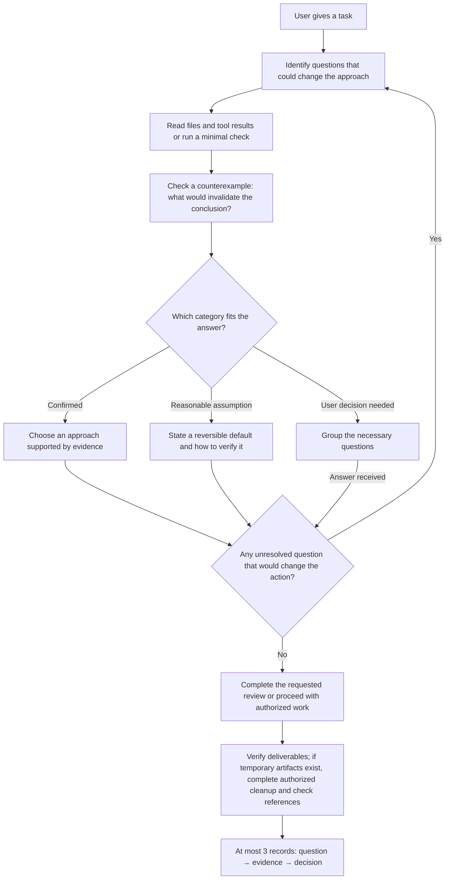

# grill-agent

[简体中文](README.md) | **English**

**Have the executing agent question its plan, check counterexamples, then act.**

`grill-agent` is a lightweight Agent Skill for reviewing plans, changing code, and analyzing data. It asks the executing agent to identify questions that matter, read the evidence, and check what could invalidate its conclusion before deciding whether to proceed, revise the plan, or ask the user for a decision.

The core is a single [SKILL.md](skills/en/grill-agent/SKILL.md). There is no service, database, or additional model API. The host agent supplies file access, tools, and verification capabilities.

```text
$grill-agent
Review this plan. Identify the assumption most likely to be wrong,
check it against the available material, and give your conclusion
with at most three key pieces of evidence. Review only for now.
```

[Skill instructions](skills/en/grill-agent/SKILL.md) · [Detailed introduction and shareable copy](docs/en/promotion.md) · [Three scenario tests](docs/en/tests.md)

## What it addresses

Agents sometimes ask users questions that existing project files already answer. They can also skip verification and keep working from an incorrect assumption.

`grill-agent` adds an evidence-based self-check: investigate what can be checked, state low-risk assumptions explicitly, and ask the user when a business decision is genuinely needed. The user receives a short conclusion, supporting evidence, and the resulting decision.

Useful for:

- **Plan reviews:** identify assumptions that affect the choice and check whether they hold.
- **Code changes:** inspect the actual entry point, callers, and failure conditions before editing.
- **Data analysis:** distinguish source records, stale summaries, and undefined business rules.
- **Delivery checks:** establish what has been verified and what still lacks evidence.
- **Task closeout:** after verifying deliverables, remove this task's disposable intermediate artifacts within the authorized scope.

Simple tasks, such as translating a sentence or fixing an obvious typo, do not need a self-review table.

## How it works



The current executing agent carries out these steps. The skill does not require a separate reviewer agent.

Before making changes, it also checks for unnecessary steps, abstractions, or configuration, limits changes to the task's scope, and defines observable completion criteria. When fixing a problem, it prefers a minimal reproduction, then checks the result of the fix.

A simple approach must still complete necessary related changes and preserve useful checks and protections. Evidence is reused while it remains valid for the final state; self-review ends once acceptance requirements are met and no known in-scope blocker remains.

### Three answer categories determine the next step

| Category | Basis | Next step |
|---|---|---|
| Confirmed | Explicit user statements or checkable files, code, and tool results | Proceed based on the evidence |
| Reasonable assumption | Incomplete evidence, but a low-risk, reversible default exists | State the assumption and verification method |
| Requires a user decision | Unavailable business information, or choices that materially affect results, permissions, cost, or external actions | Ask only the necessary questions together |

Answering its own questions does not authorize an agent to invent interfaces, data, business definitions, or user approval. A request for review remains a review unless changes are also requested.

### Look for evidence that could overturn the plan

The skill asks for a concrete counterexample or failure condition. For example, before reusing an equipment alarm summary, check whether the source data belongs to the same batch. If the summary is stale, recompute the result.

Finding no counterexample does not establish that validation passed. Checks that could not be performed remain unverified.

### Leave a checkable record

For important decisions, provide at most three brief records:

> **Key question:** Does the old summary represent this alarm batch?  
> **Evidence:** The project notes identify it as the previous batch; A1, A2, and A5 in the current CSV are still unresolved.  
> **Decision:** Recompute from the current records instead of reusing the all-zero result.

These records explain the evidence and decisions; they do not request the model's complete internal reasoning.

### Task closeout: temporary-file cleanup

Before creating files, distinguish final deliverables, files needed for maintenance or reproduction, and disposable intermediate artifacts. Follow the project's directory conventions. If none exist, use a separate `work/<task-name>/` directory and track purpose and ownership in task context, without creating another cleanup manifest.

The closeout order is: **verify deliverables → clean up authorized temporary files → check deliverables and references → report results**. Skip cleanup if the task created no temporary files.

| File | Disposition |
|---|---|
| One-off probe scripts, debug output with no remaining diagnostic purpose, intermediate conversions | Remove only if created by this task, no longer needed, free of dependencies, and authorized for deletion |
| Drafts and preview copies superseded by the final result | First confirm that required content is in the final result and the same conditions hold |
| Regression tests, necessary test data, generation scripts required for reproduction | Keep |
| Images, styles, or data referenced by deliverables | Keep; resolve the dependency before considering removal |
| Unresolved-issue diagnostics, recovery backups, files used by running tasks | Keep |
| User source material, pre-existing files, other tasks' files | Exclude from this task's automatic cleanup |

Names containing `test`, `tmp`, or `draft`, or untracked Git status, do not establish disposability. Before deletion, check resolved absolute paths and the allowed scope; symbolic links and directory junctions must not extend cleanup beyond it. Keep files whose ownership, purpose, or permissions are unclear and report them together.

Deletion follows existing user authorization and host rules. If confirmation is required, list candidates and reasons, including numbering or risk levels when the host requires them. Do not request authorization again for the same already-authorized scope. The skill grants no deletion permissions and does not automatically sweep an entire workspace. After cleanup, check affected deliverables and references and briefly report removed and pending items.

## Installation and use

### Choose one language

| Language | Skill file |
|---|---|
| Chinese | [SKILL.md](skills/zh/grill-agent/SKILL.md) |
| English | [skills/en/grill-agent/SKILL.md](skills/en/grill-agent/SKILL.md) |

Both versions use the name `grill-agent` and express the same rules. Install only one. Chinese is the source version; English is its translation. Future rule changes should be made in Chinese first and reflected in English. There is no automated translation or synchronization service.

### Install in Codex

Give Codex this request for the English version:

```text
$skill-installer
Install the skill from https://github.com/0731koukou/grill-agent
using the path skills/en/grill-agent. The skill name is grill-agent.
Install only this English version.
```

For manual installation, copy the English file into a supported skill directory as `grill-agent/SKILL.md`. The current official guide lists `~/.agents/skills/` for user-level skills and `.agents/skills/` for project-level skills. Avoid installing duplicate copies under multiple discovery directories. If the skill does not appear, check the skill list and restart the host if necessary. See the [official OpenAI skills guide](https://learn.chatgpt.com/docs/build-skills).

```text
~/.agents/skills/
└── grill-agent/
    └── SKILL.md
```

The Chinese version has been installed, discovered, and explicitly invoked in a local Codex environment. The English translation has been reviewed for matching instructions and passed format validation; the three behavioral scenarios have not been rerun against the English text. Other agent hosts may use different loading paths and invocation syntax and have not been individually tested.

### Three requests to try

**Review only:**

```text
$grill-agent
Review this data collection plan. Check the available material and
identify conditions that would invalidate it. Give recommendations
and evidence. Do not modify files in this task.
```

**Check, then fix:**

```text
$grill-agent
Fix this endpoint's timeout. Inspect the actual call chain and logs,
verify the most likely failure cause, then make the smallest fix
and check the result.
```

**Check analysis rules:**

```text
$grill-agent
Count unresolved alarms in this batch using the project's existing rules.
If the summary conflicts with the source data, investigate why and
explain which evidence you used.
```

Whether the agent makes changes depends on your actual request and the host's permissions. The skill grants no additional permissions.

## Relationship to grill-me

The idea originated from `grill-me` / `grilling` in [Matt Pocock's skills collection](https://github.com/mattpocock/skills). The comparison below refers to its workflow at commit `84fdeffd12f2ee307994d1eb6feb48173b6e0502`; upstream may change.

| Aspect | Referenced grill-me / grilling version | grill-agent |
|---|---|---|
| Who answers decision questions | The user, round by round | The executing agent investigates and answers first, asking the user when needed |
| Fact gathering | May delegate environmental checks to subagents | Done by the current executing agent by default |
| Stopping condition | Decision branches are resolved and the user confirms shared understanding | No unresolved question would change the action; continue within the original task scope |
| User-facing output | Questions and recommended answers | Brief evidence, decisions, and unresolved items |

`grill-agent` is independently written. It does not depend on or replace `grill-me`. An interview workflow remains useful when the task is to gather requirements from the user.

## What has been verified

On 2026-09-29, the initial Chinese version passed a format check and three isolated behavioral scenarios using synthetic inputs. Each independent evaluator received the skill and scenario materials without the expected answer. The maintainer then checked the outputs.

On 2026-09-30, both language versions gained rules for change scope, completion criteria, full delivery, preserving useful protections, and stopping verification. The translations were reviewed and both versions passed format validation; these additions have not been separately behavior-tested. The table below retains the initial version's test results.

Task-closeout cleanup rules were added the same day and checked in one independent, read-only simulation using the Chinese skill. Of 10 candidates, 2 were selected for removal; deliverable dependencies, reproduction scripts, regression tests, other owners' files, in-use files, and an out-of-scope junction were retained. This checked selection and closeout decisions, with no real deletion. The English version received a translation review and format validation. See the [cleanup simulation record](docs/en/tests.md#task-closeout-cleanup-read-only-simulation) for the inputs and results.

| Scenario | Observed result |
|---|---|
| Complete counting rules, but a stale summary | Recomputed P-101=2, P-102=1, P-103=0 from the CSV and explained why the old summary was inapplicable |
| Missing valid-status and severity definitions | Did not invent a final maintenance list; grouped the missing definitions into questions |
| Request only to prepare announcement materials | Produced a draft and identified missing access and authorization information without claiming publication |

See [test records](docs/en/tests.md) for inputs, acceptance checks, and result summaries. These observations apply to those three scenarios. There was no no-skill control group, cross-model evaluation, or repeated sampling, so they do not establish reductions in hallucinations, time savings, or accuracy improvements. The English test document translates those records; it does not report new English-version runs.

## Limits

- This is a set of behavioral instructions. Its effect depends on the host model, tools, and context; it is not an enforcement engine.
- Which questions it reduces must be observed in actual use. Business goals and key approvals may still require the user.
- Checking counterexamples can require additional reading and tests, increasing time and model usage. The skill itself adds no paid service.
- Public posting, spending, and production changes remain subject to user authorization and host rules.
- Self-checks do not replace testing, field validation, or professional judgment.

If the agent asks questions that already have answers, proceeds on unsupported assumptions, or reports checks without evidence, please open an issue. Include a shareable task, minimal inputs, actual output, and expected behavior. Remove credentials and private data.

## Repository layout

```text
README.md          Chinese entry
README.en.md       English entry
skills/
  zh/grill-agent/  Chinese skill (SKILL.md)
  en/grill-agent/  English skill (SKILL.md)
docs/
  zh/              Chinese introduction and test records
  en/              English introduction and test records
```

Install only `skills/zh/grill-agent` or `skills/en/grill-agent`. Copy the selected skill folder, not the entire repository, into a skill discovery directory.
