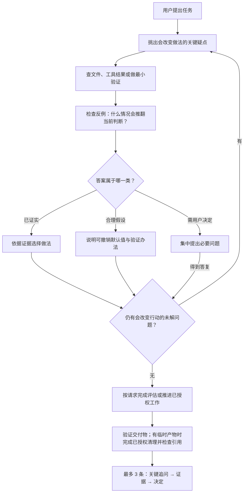

# grill-agent

**简体中文** | [English](README.en.md)

**让执行智能体先追问自己、查证反例，再行动。**

`grill-agent` 是一份轻量的 Agent Skill。遇到方案、代码修改或分析任务时，它要求执行智能体先找出关键疑点，读取证据，检查什么情况会推翻原来的判断，再决定继续执行、修改方案，还是向用户补充提问。

核心只有一份 [SKILL.md](skills/zh/grill-agent/SKILL.md)。没有运行服务、数据库或额外模型接口；查文件、运行检查等能力由宿主智能体提供。

```text
$grill-agent
检查这个方案：先找出最可能不成立的假设，用现有资料核对，
给出结论和最多 3 条关键证据。本次只做评估。
```

[查看技能原文](skills/zh/grill-agent/SKILL.md) · [看详细介绍与推广文案](docs/zh/推广介绍.md) · [看三组场景测试](docs/zh/测试记录.md)

## 它想解决什么

使用智能体时，经常遇到两种情况：它把能从文件里找到答案的问题交回用户；或者它跳过检查，直接围绕一个不成立的假设往下做。

`grill-agent` 给这中间增加了一次有依据的自检：能查到的自己查，能用低风险默认值处理的说明假设，真正需要业务决定的再问用户。用户看到的是简短的结论、证据和决定。

适合用在：

- **方案审查**：找出会影响选择的前提，检查它是否成立。
- **代码修改前**：核对实际入口、调用关系和失败条件，再动手。
- **数据分析**：区分原始记录、过期摘要和没有定义的业务口径。
- **交付检查**：确认哪些结果已经验证，哪些仍缺证据。
- **任务收尾**：交付验证后，清理已授权范围内、用途已结束的本次临时产物。

对于翻译一句话、改一个明确的错别字等简单任务，不要求凑出一张自检表。

## 它怎么工作



这些步骤由当前执行智能体完成，技能不要求额外启动一个审查智能体。

修改前还会检查是否存在不必要的步骤、抽象或配置，将改动限定在任务所需范围内，并明确可观察的完成条件。修复问题时，优先用最小复现确认问题，完成后核对修复结果。

选择简单方案时仍需完成必要的关联调整，保留有实际作用的校验和保护。已有证据对最终状态仍有效时直接复用；结果满足验收要求且没有已知范围内阻塞时结束自检。

### 三类答案决定下一步

| 类别 | 判断依据 | 下一步 |
|---|---|---|
| 已证实 | 用户明确说明，或存在可核对的文件、代码、工具结果 | 根据证据继续 |
| 合理假设 | 证据暂不充分，但有低风险、可撤销的默认值 | 写明假设和验证办法 |
| 仍需用户决定 | 缺少无法取得的业务信息，或选择明显影响结果、权限、费用和对外操作 | 集中问必要的问题 |

“自己回答”不允许编造接口、数据、业务定义或用户授权。用户只要求审查时，技能也不把审查自动变成修改任务。

### 主动找能推翻方案的证据

技能要求检查具体的反例或失败条件。例如，准备沿用一份设备告警摘要时，要核对原始数据是否属于同一批次。发现摘要过期，就重新计算，而不是替旧结论寻找解释。

没有找到反例，也不能直接写成“验证通过”。没有条件执行的检查应标明未验证。

### 给用户留下可核对的记录

重要决策最多给出 3 条简短记录：

> **关键追问：** 旧摘要能代表本批告警吗？
>
> **证据：** 约定文件说明摘要属于上一批；本批 CSV 的 A1、A2、A5 尚未关闭。
>
> **决定：** 用本批原始记录重算，不沿用全零结果。

记录用于说明依据和决定，不要求展示模型的全部内部推理。

### 任务收尾：临时文件清理

生成文件前先区分正式成果、维护或复现所需文件与一次性临时产物。沿用项目目录约定；没有约定时，将临时产物放在独立的 `work/<任务名>/` 中，在任务上下文里记录用途和归属，不另建一套清理清单文件。

收尾顺序是：**验证交付物 → 清理已授权临时文件 → 检查交付物与引用 → 汇报结果**。本任务没有产生临时文件时，跳过清理。

| 文件 | 处理原则 |
|---|---|
| 一次性探测脚本、已无诊断用途的调试输出、中间转换文件 | 确认本次创建、用途结束、无依赖且已获删除授权后清理 |
| 已被最终成果替代的草稿和预览副本 | 确认所需内容已进入最终成果，且满足上述条件后清理 |
| 回归测试、必要测试数据、复现所需生成脚本 | 保留 |
| 交付物引用的图片、样式或数据 | 保留；先处理依赖关系才能考虑清理 |
| 未解决故障的诊断资料、恢复所需备份、运行中任务使用的文件 | 保留 |
| 用户原始资料、任务前已有文件、其他任务文件 | 不纳入本次自动清理 |

文件名含 `test`、`tmp`、`draft`，或 Git 显示未跟踪，都不能单独证明文件无用。删除前核对实际绝对路径和允许范围；符号链接、目录联接不得将清理扩展到范围之外。归属、用途或权限不明确时保留并集中说明。

删除权限沿用用户授权和宿主规则。需要确认时先给出候选和原因；宿主要求编号或风险等级时一并列出。已授权的同一范围不重复确认。技能不会授予删除权限，也不会自动扫描清理整个工作区。清理后只检查受影响的交付物和引用，简短报告已清理及待处理项。

## 安装与使用

### 选择语言版本

| 语言 | 技能文件 |
|---|---|
| 中文 | [SKILL.md](skills/zh/grill-agent/SKILL.md) |
| English | [skills/en/grill-agent/SKILL.md](skills/en/grill-agent/SKILL.md) |

两个版本的技能名称均为 `grill-agent`，规则一致，安装时二选一。中文为标准源，英文为翻译版；后续规则变更先改中文，再同步英文。本仓库没有自动翻译或同步服务。英文安装方法见 [English README](README.en.md)。

### 在 Codex 中安装

可以把下面的话交给 Codex：

```text
$skill-installer
从 https://github.com/0731koukou/grill-agent 安装技能。
技能目录为 skills/zh/grill-agent，名称为 grill-agent。
只安装这个中文版。
```

也可以只下载本仓库的 `SKILL.md`，放入 Codex 支持的技能目录，保持 `grill-agent/SKILL.md` 结构。当前官方文档列出的用户级目录是 `~/.agents/skills/`，项目级目录是 `.agents/skills/`。不要在多个发现目录重复放置同名副本。安装后若未出现，检查技能列表，必要时重启宿主。参见 [OpenAI 官方技能文档](https://learn.chatgpt.com/docs/build-skills)。

```text
~/.agents/skills/
└── grill-agent/
    └── SKILL.md
```

本项目已在 Codex 本地环境中安装、发现并显式使用。其他 Agent 宿主的加载目录和调用语法需按其文档调整，尚未逐一验证。

上述安装和行为测试针对中文版；英文版已核对规则含义并通过格式校验，尚未单独重跑三组行为测试。

### 三个可以直接使用的请求

**只审查方案：**

```text
$grill-agent
检查这份数据采集方案。先核对已有资料，找出会推翻方案的条件。
给出建议和依据，本次不修改文件。
```

**自检后修改：**

```text
$grill-agent
修复这个接口的超时问题。先检查真实调用链和日志，
查证最可能的失败原因，再做最小修改并验证结果。
```

**核对分析口径：**

```text
$grill-agent
按项目已有约定统计这批未关闭告警。
如果摘要和原始数据冲突，查清原因并说明采用了哪份依据。
```

是否实施修改，取决于你实际下达的任务和宿主权限；技能本身不增加权限。

## 与 grill-me 的关系

本项目的出发点来自 [Matt Pocock 的技能集合](https://github.com/mattpocock/skills) 中的 `grill-me` / `grilling`。参考的是该项目提交 `84fdeffd12f2ee307994d1eb6feb48173b6e0502` 的流程，不代表上游以后不会变化。

| 对照点 | 所参考版本的 grill-me / grilling | grill-agent |
|---|---|---|
| 回答决策问题的人 | 用户逐轮回答 | 执行智能体先查证并作答，必要时再问用户 |
| 查事实 | 可派子智能体查环境事实 | 默认由当前执行智能体完成 |
| 结束条件 | 决策分支处理完，用户确认共同理解 | 关键问题已有证据或明确假设，按原任务范围继续 |
| 给用户的内容 | 问题与推荐答案 | 简短的依据、决定和未解项 |

`grill-agent` 是独立编写的技能文件，不依赖原 `grill-me`，也不会替换它。需要采访用户、逐项收集需求时，原来的访谈方式仍然有用。

## 已验证到哪一步

2026-09-29，对初始中文版做了格式检查，以及三组人工构造的隔离行为测试。每组由独立测试执行者读取同一份技能和场景资料，执行者没有拿到预期答案；维护者随后核对输出。

2026-09-30，中英文版补充了改动范围、完成条件、完整交付、保留有效保护和验证停止条件，已核对翻译并通过格式校验；这些增补尚未单独进行行为测试。下表保留的是初始版本的测试结果。

同日新增任务收尾清理规则，并用中文版完成一次独立的只读模拟：在 10 个候选中选出 2 个可清理项，保留交付依赖、复现脚本、回归测试、他人文件、运行中使用的文件和越界目录联接。模拟只检查选择与收尾判断，没有执行真实删除；英文版完成翻译核对和格式校验。完整输入和结果见[清理模拟记录](docs/zh/测试记录.md#任务收尾清理只读模拟)。

| 场景 | 观察到的结果 |
|---|---|
| 有完整统计口径，但存在过期摘要 | 从 CSV 重算，得到 P-101=2、P-102=1、P-103=0，并说明旧摘要不适用 |
| 缺少有效告警与严重度定义 | 没有编造最终维修名单，集中提出缺失口径 |
| 仅要求整理公告材料 | 生成待核对稿，指出入口与授权资料缺项，没有声称已经发布 |

输入、验收方式及结果摘要见 [测试记录](docs/zh/测试记录.md)。这些测试表明这三个场景的行为符合预期；没有无技能对照组、跨模型评测或多次重复统计，不能据此声称“降低了多少幻觉”“节省了多少时间”或“准确率提升了多少”。

## 使用边界

- 它是一份行为指令，效果取决于宿主模型、可用工具和已有上下文，不是强制执行引擎。
- 能减少哪些提问，需要在实际任务中观察；业务目标、关键授权等问题仍可能需要用户回答。
- “查反证”需要额外阅读或检查，可能增加单轮耗时和模型用量。技能本身不新增付费服务。
- 公开发布、付费、生产变更等操作仍遵守用户授权和宿主规则。
- 不能以自检代替测试、现场验证或专业判断。

如果你遇到它反复问已有答案、凭假设推进，或输出了没有证据的“自检记录”，欢迎提交 Issue。附上可公开的任务、最小输入、实际输出和你期望的行为即可，请去掉凭据和私人数据。

## 仓库目录

```text
README.md          中文入口
README.en.md       English entry
skills/
  zh/grill-agent/  中文技能（SKILL.md）
  en/grill-agent/  English skill (SKILL.md)
docs/
  zh/              中文推广介绍、测试记录
  en/              English introduction and test records
```

安装时选择 `skills/zh/grill-agent` 或 `skills/en/grill-agent`，只复制所选技能目录；不要把整个仓库放入技能发现目录。
